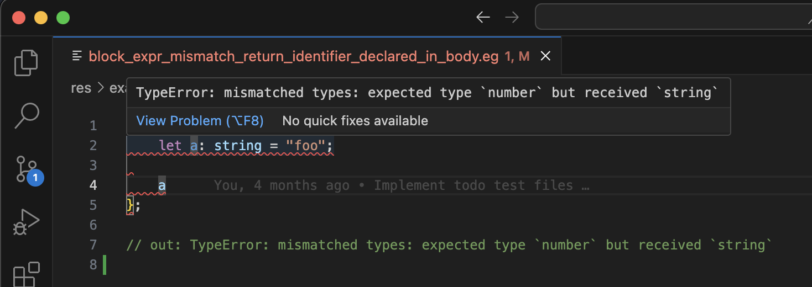
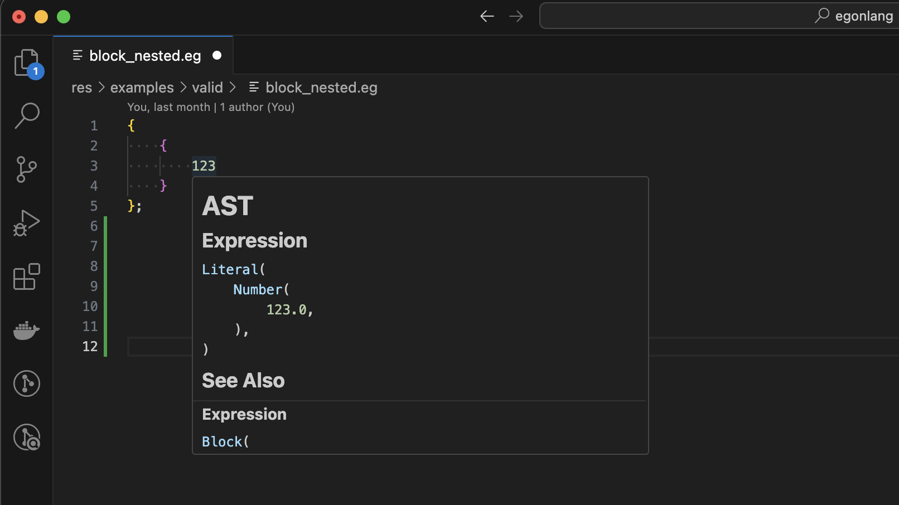

# Egon Language Development Guide

## Getting Started

1. Clone/copy down https://github.com/egonlang/egonlang
2. Install the [requirements](#requirements)
3. Run `just clean build verify`
4. Install the [VS Code extension](#vs-code-extension)
5. Browser the code [examples](./res/examples/)

## Requirements

- [rust](https://www.rust-lang.org/)
- [nextest](https://nexte.st/)
- [just](https://just.systems/)
- [mdbook](https://rust-lang.github.io/mdBook/index.html)
- [grcov](https://github.com/mozilla/grcov)

## Technologies

- [lalrpop](https://lalrpop.github.io/lalrpop/)
- [logos](https://docs.rs/logos/latest/logos/)

## Project Structure

- [core](./egonlang-core/): Library responsible for lexing, and parsing egon code
- [errors](./egonlang-errors/): Shared errors used across egon crates
- [diagnostics](./egonlang-diagnostics/): Library for mapping different types (e.g. errors) to diagnostics
- [types](./egonlang-types/): Library for types and type envrionments
- [verifier](./egonlang-verifier/): Library responsible verifying AST (e.g. syntax errors, type checking)
- [lsp](./egonlang-lsp/) Language server
- [cli](./egonlang-cli/): Command line tool to lex and parse egon code files 
- [vsc](./vsc/): VS Code language extension
- [book](./egon-book/) The egon book documenting the language

### Support/Utils

- [span](./span/) A library providing the `Span` and `Spanned<T>` types
- [str-idxpos](./str-idxpos/) A library for mapping between 0-based string indexes and 0-based line/column positions
- [tracelog] A library for debugging logging that provides text label and line/column location

## Build, test, verify, etc...

| Command                        | Description                                                                                             |
| ------------------------------ | ------------------------------------------------------------------------------------------------------- |
| `just test`                    | Run all the tests                                                                                       |
| `just test-trace`              | Run all the tests and log using `tracelog!` macro                                                       |
| `just coverage`                | Run all the tests with coverage enabled. Writes HTML report to `./target/coverage`                      |
| `just clean-coverage`          | Clean up any `**/*.profraw` generated from running coverage. Handy if `just coverage` doesn't get them. |
| `just lint`                    | Run lint and any report errors                                                                          |
| `just verify`                  | Runs tests and linting                                                                                  |
| `just verify-trace`            | Runs tests (logging with `tracelog!` macro) and linting                                                 |
| `just verify-with-logs`        | Runs tests and linting but dumps stdout and stderr to `out.log` & `err.log` respectively                |
| `just format`                  | Run formatting                                                                                          |
| `just build`                   | Build the project (debug)                                                                               |
| `just build-release`           | Build the project (release)                                                                             |
| `just clean`                   | Clean build artifacts                                                                                   |
| `just cli COMMAND PATH`        | Run the egon command with the `COMMAND` (`lex`, `parse`, or `verify`) and the file `PATH` in `PWD`      |
| `just cli-trace COMMAND PATH`  | Run the egon command (logging with `tracelog!` macro)                                                   |
| `just build-docker`            | Build the docker image for the egon language                                                            |
| `just run-docker COMMAND PATH` | Run the egon command in docker e.g. `$ just run docker parse ./path/to/file.eg`                         |
| `just lsp`                     | Start the egon language server                                                                          |
| `just serve-book`              | Serve the [egon book](./egon-book/) at http://localhost:3000                                            |
| `just docs`                    | Generate API documentation in `target/doc`                                                              |
| `just open-docs`               | Generate API documentation then open them in browser                                                    |

## Resources/Documentation

- [API](https://egonlang.github.io/egonlang/docs/egon/)
- [Egon Book](https://egonlang.github.io/egonlang/book/introduction.html)

## CLI

### Lex

Lex an input file in to a list of tokens.

```shell
just cli lex ./res/examples/valid/range_expression_start_only.eg 
```

### Parse

Parse an input file in to an AST (abstract syntax tree).

```shell
just cli parse ./res/examples/valid/range_expression_start_only.eg 
```

### Verify

Parse an input file and verify the AST (e.g. syntax errors, type checking).

```shell
just cli verify ./res/examples/valid/range_expression_start_only.eg 
```

#### With Verify Tracing

Enable trace logs to help debug the verification command.

```shell
just cli-trace verify ./res/examples/valid/range_expression_start_only.eg 
```

## Run Single Test

```shell
just test path_056__UP_res_examples_invalid_infix_type_mismatch_string_eg
```

### With Verify Tracing

This will enable trace logs from the verifier.

```shell
just test-trace path_056__UP_res_examples_invalid_infix_type_mismatch_string_eg
```

## VS Code Extension

The [VS Code extension](./vsc/) supports syntax highlighting, snippets, and integration with the [language server](./egonlang-lsp/).





### Usage

1. Uninstall any previous version of the extension
2. Run `just clean build`
3. Install the latest build `./vsc/out/egon-language-*.vsix`
4. Open any egon file `*.eg`

### Commands

- Start/stop/restart language server
- Lex/parse/verify a file
